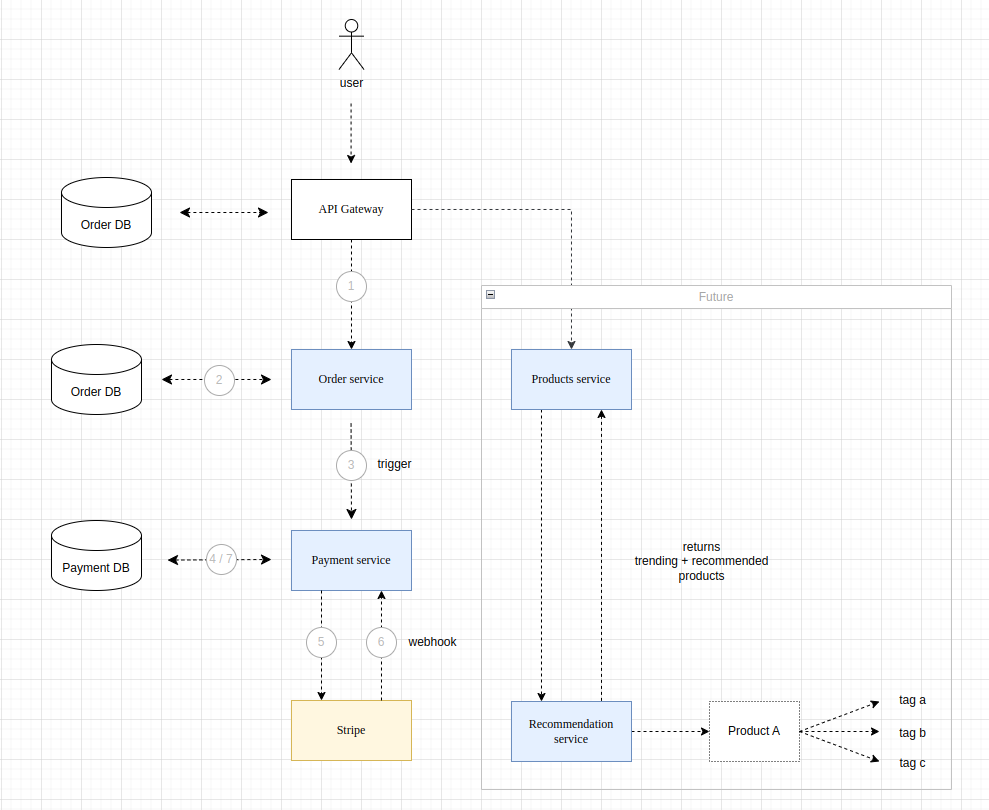

# Order processing system (Microservice Architecture)
`Under development`

## Project Description

An example of multiple services being driven through one API server (Microservice Architecture)

<br>

## Overview

<div align="center">

</div>

<br>

## Docker Container Description

This system consists of multiple services / containers :

- api_server : Entry point to connections
- db : PostgreSQL container
- pgadmin (optional) : Management tool for viewing tables and data

<br>

## System Prerequisites

1. Make sure you have docker and docker-compose installed on your local system.
2. Creating a `.env` environment file
    ```
    POSTGRES_USER=postgres
    POSTGRES_PASSWORD=postgres
    POSTGRES_DB=test_db

    DATABASE_URL=postgresql://postgres:postgres@db/bills_db

    PGADMIN_DEFAULT_EMAIL=<email>
    PGADMIN_DEFAULT_PASSWORD=<password>
    ```
3. Creating a database
    - Open Pgadmin tool here [`http://0.0.0.0:5050/`](http://0.0.0.0:5050/) and create a :
        - User with username and password `postgres`
        - Database with name `test_db`
4. Migrating changes using alembic
    1. Migrate changes (Migrations will be automated in future, below commands won't be required)
        ```
        docker-compose run web alembic revision --autogenerate -m "<your-commit-message>"
        ```
    2. Update the head (push migrations)
        ```
        docker-compose run web alembic upgrade head
        ```

<br>

## Spinning up the server using Docker

1. The following command will spin up all the docker container services
    ```
    docker-compose up --build
    ```
2. Go to [`http://0.0.0.0:8000/docs/`](http://0.0.0.0:8000/docs/) for viewing the swagger document.
3. If you're using Pgadmin database management tool, open [`http://0.0.0.0:5050/`](http://0.0.0.0:5050/) to view tables and data.

<br>

## Important Links

Swagger Doc : [http://0.0.0.0:8000/docs/](http://0.0.0.0:8000/docs/) <br>
Redoc Page  : [http://0.0.0.0:8000/redoc/](http://0.0.0.0:8000/redoc/) <br>
Pgadmin DB  : [http://0.0.0.0:5050/](http://0.0.0.0:5050/)
